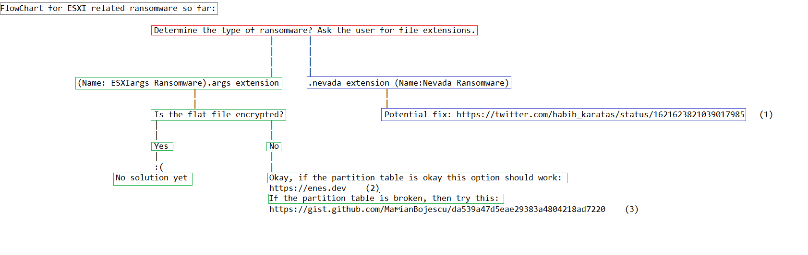

# ESXIransomwareRemovalFlowChart
ESXI related ransomware removal flow chart (How to handle this incident)

# Flow chart

# References in the flowchart:
1) https://twitter.com/habib_karatas/status/1621623821039017985
2) https://enes.dev 
3) https://gist.github.com/MarianBojescu/da539a47d5eae29383a4804218ad7220

# Notes
- Always ask your user if they have backups that they can restore, after backing up an update is needed ASAP. 
- Still, it is recommended to disable SLP just in case and to monitor the systems. 
- NEVADA isn't as trending as ARGS is, but we included it for its activity within the last 4 days, this is important to note since the most important thing on the chart is ARGS. We just want to aggregate the fixes, so if there are other ESXi related RW feel free to report them to us. 

# Monitoring options (args) : 
1) https://search.censys.io/search?resource=hosts&sort=RELEVANCE&per_page=25&virtual_hosts=EXCLUDE&q=services.http.response.html_title%3A%22How+to+Restore+Your+Files%22
2) https://www.shodan.io/search?query=html%3A%22We+hacked+your+company+successfully%22+title%3A%22How+to+Restore+Your+Files%22
(and obviously filter by your country or however you like)

# Malware code (args)
- In the folder technical_analysis.
- Or
- https://pastebin.com/y6wS2BXh (main .sh script)
- https://pastecode.io/s/ze8f5jg7 (encrypt library)

- Explaination: Main sh script uses encrypt library and a public key to encrypt the contents.

# Something is wrong with this chart or README?
- Please Contact us on MM. 
- This is just the second version. 

# Thanks
- Huge thanks to people from MM, especially L. 
- Thank you to E. for the Nevada comment 

